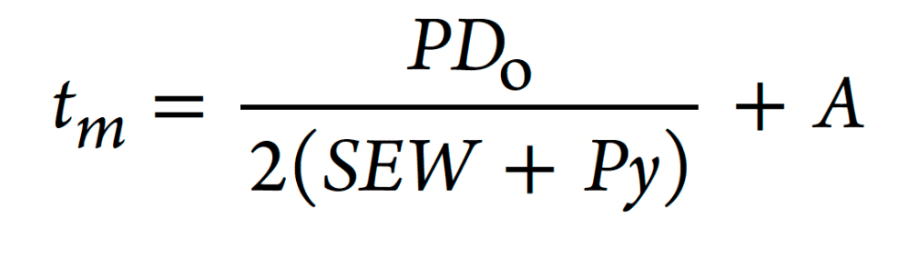
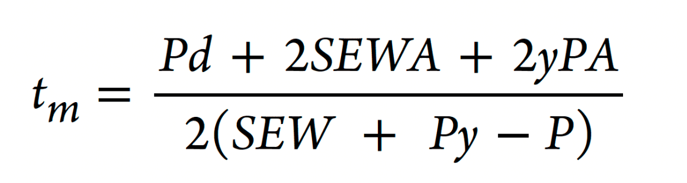

# Design Conditions and Criteria
According to ASME B31.1, Power Piping System shall be designed:
-  for the most severe conditions
- Conditions having significant effects on designs are:
    - Pressure
    - Temperature
    - Ambient influences
    - Dynamic Effects
    - Weight Effects

### Criteria
1. Pressure-Temperature Ratings for Piping Components
2. Allowable Stress Values
3. Limits for Sustained and Displacement Stresses

### Allowances
- Corrosion or Erosion
- Threading and Grooving
- Bending
- Mechanical Strength

## Allowable Stress Values
For power piping, the allowable stress values are given in the Tables of Appendix A ("Allowable Stresses Table") based on material and design temperature.

Design temperatures are assumed to be the same as that of the fluid unless tests or calculations support the use of other data.  If this is the case, the design temperature shall not be less than the average of the fluid temperature and the outside wall temperature. 

## Pressure Design
The pressure design determines the minimum thickness of the pipe wall

Formula when outside diameter is fixed:

Formula when internal diameter is fixed:

- **A**     = Additional thickness
- **$D_O$**    = Fixed outer diameter
- **d**     = Fixed inner diameter
- **P**     = Internal design pressure
- **SE** or **SF** = Maximum allowable stress
- **y**     = coefficient (provided by the relevant table in the Codebook)
- **W**     =   Weld strength reduction factor

## Components and Joints
The B31.1 Code imposes design limitations on components and joints, including fittings and bends, gaskets, and welded or threaded joints.

### Components
- Fittings and Bends
- Valves
- Flanges, Gaskets and Bolting

### Joints
- Welded
- Brazed and Soldered
- Expansion
- Threaded

## Flexibility
Flexibility may be achieved by adding fittings, bends, offsets and loops.
Flexibility analysis is used to determine the response of the system to thermal loads. To simplify the analysis, some basic principles are used:
- Based on nominal dimensions
- Moment and torsion only
- Modulus of Elasticity at room temperature is required for stress calculations. The "hot" Modulus of elasticity can be used when calculating a reaction
- Flexibility and Stress intensification factors
